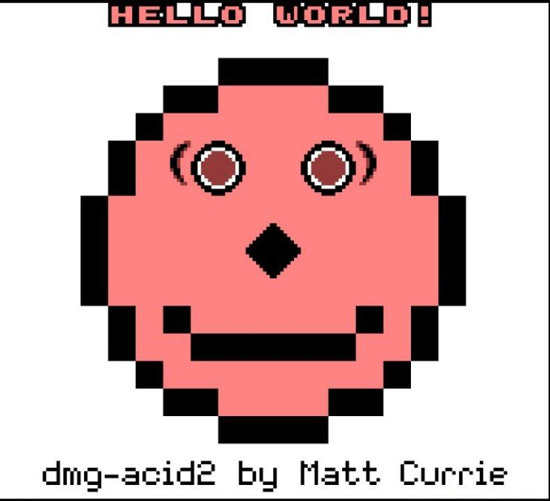
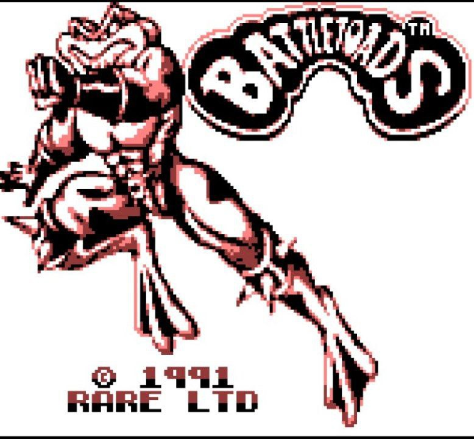
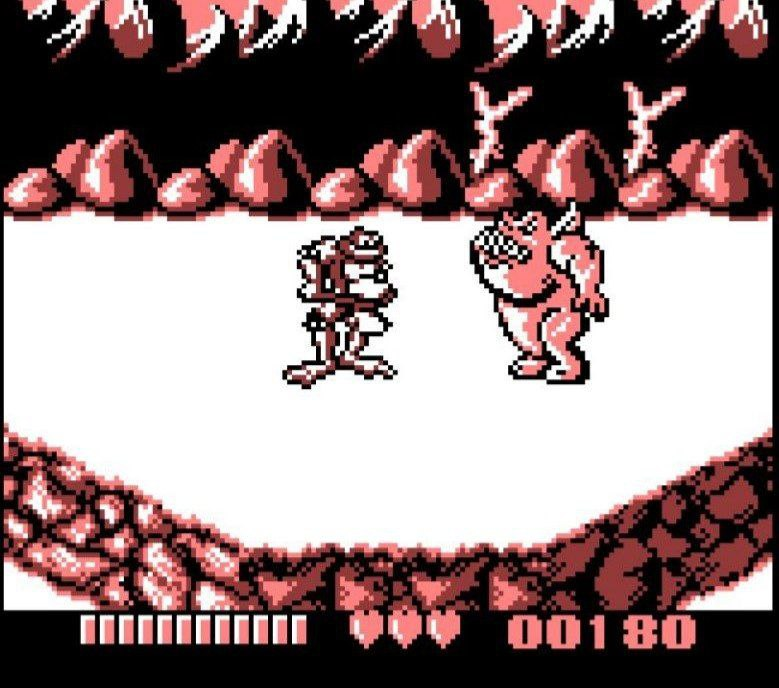

# CrapGB SDL2 variant

A gameboy emulator written in C for learning purposes
Passes blargg's instruction tests and [dmg-acid2](https://github.com/mattcurrie/dmg-acid2) PPU test

## Current state of the project

* Full instruction set
* Accurate timers
* Kinda accurate PPU (with some timing issues)
* Rendering is done by line so no mid scanline effects
* Input polling is done once per frame so LY is the same every joypad interrupt
* Only MBC1 is supported
* No sound

## Screenshots





## Compiling

Dependencies
* SDL2
* clang/gcc
* make

To compile just write
```bash
make 
```


## Usage

```bash
crapgb-sdl2 some-rom.gb
```

## Special Thanks
* [GBdev Pandocs](https://gbdev.io/pandocs/), main source of information regarding Gameboy emulation development 
* [PeanutGB by deltabeard](https://github.com/deltabeard/Peanut-GB/) MIT Licence, a very well written emulator, SBC instruction was taken from there
* [Sameboy by LIJI32](https://github.com/LIJI32/SameBoy/tree/master) MIT Licence, sometimes by looking at code there you will get more understanding then by reading the docs. DAA, LD HL,SP+e8, ADD SP,s8 instructions were taken from there